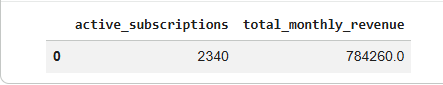
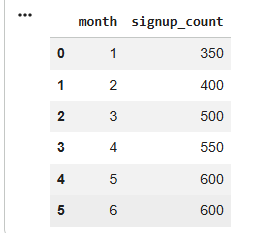
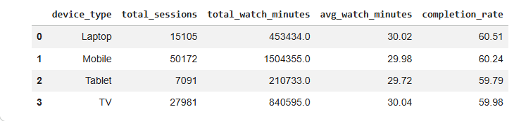
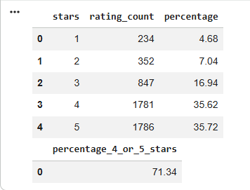
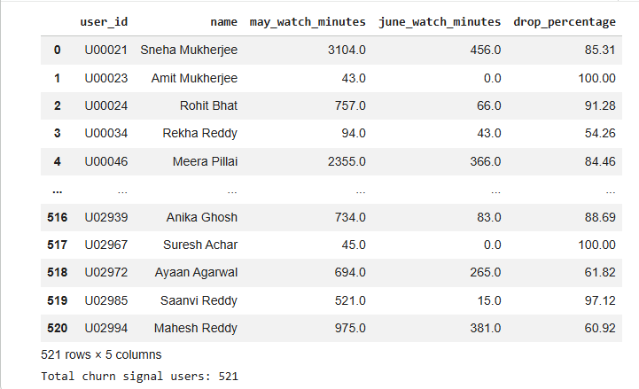

# BingePlay — Streaming Analytics


An Advanced SQL analytics project based on a fictional streaming platform, BingePlay. The project analyzes user behavior, subscriptions, content performance, viewing activity, ratings, engagement patterns, and potential churn signals using MySQL and Python.

---

## 📌 Project Overview

BingePlay is a fictional streaming platform dataset containing information about:

- Users
- Subscription history
- Shows and content metadata
- Watch sessions
- User ratings

The project consists of **12 business-oriented SQL problems**, progressing from foundational SQL concepts to advanced analytical SQL techniques.

The objective was to transform real-world business questions into SQL queries and derive meaningful insights from the available data.

---

## 🎯 Business Objectives

The analysis focuses on questions such as:

- How much monthly recurring revenue is generated from active subscriptions?
- Which months had the highest number of new user signups?
- How does viewing behavior differ across devices?
- How are user ratings distributed?
- Do BingePlay Originals perform better than acquired content?
- Which users demonstrate binge-watching behavior?
- Which users signed up but never watched anything?
- Are Premium/Family subscribers potentially over-paying?
- How successful are subscription upgrades?
- Which shows generate the most cliffhanger comeback behavior?
- Which users maintain long-term weekly engagement?
- Which users show early signs of churn?

---

## 🗂️ Database Schema

The project uses five primary tables:

| Table | Description |
|---|---|
| `users` | User profile and signup information |
| `subscriptions` | Subscription plans and subscription history |
| `shows` | Show metadata, ratings, and minimum plan requirements |
| `watch_sessions` | User viewing activity and completion information |
| `ratings` | User ratings for shows |

---

## 🧩 Project Structure

### Tier 1 — Foundations

| # | Analysis |
|---|---|
| Q1 | Active Revenue |
| Q2 | Signup Momentum |
| Q3 | Device Analytics |
| Q4 | Rating Distribution |
| Q5 | Originals vs Acquired Content |

### Tier 2 — Joins & Subqueries

| # | Analysis |
|---|---|
| Q6 | Binge Day Detection |
| Q7 | Q1 Signups Who Never Watched |
| Q8 | Over-Paying Premium/Family Users |
| Q9 | Upgrade Success Cohort |
| Q10 | Cliffhanger Comebacks |

### Tier 3 — Advanced SQL / Killer Questions

| # | Analysis |
|---|---|
| Q11 | Consecutive-Week Engagement |
| Q12 | Churn Signal Detection |

---

## 🛠️ Technologies Used

- **MySQL** — Database and SQL analysis
- **Python** — Analytical workflow
- **Pandas** — Query execution and result presentation
- **SQLAlchemy** — Python-to-MySQL connectivity
- **PyMySQL** — MySQL database driver
- **Google Colab** — Development and execution environment
- **Jupyter Notebook** — Project deliverable format

---

## 🧠 SQL Concepts Applied

This project covers a wide range of SQL techniques:

- `SELECT`
- `WHERE`
- `GROUP BY`
- `HAVING`
- Aggregate functions
- `CASE` expressions
- `JOIN`
- `LEFT JOIN`
- Self-joins
- Subqueries
- Correlated subqueries
- `EXISTS`
- `NOT EXISTS`
- Common Table Expressions (CTEs)
- Window functions
- `ROW_NUMBER()`
- `LAG()`
- Date and time functions
- Conditional aggregation
- Percentage calculations
- Cohort analysis
- Gaps-and-islands pattern

---

## 🔎 Key SQL Challenges

### 1. NULL Handling

Q7 demonstrates the classic SQL `NOT IN` and `NULL` problem.

A `NOT IN` subquery can produce unexpected results when the subquery contains `NULL` values. The analysis therefore uses a `LEFT JOIN ... IS NULL` approach to correctly identify Q1 users who never watched anything.

### 2. Anti-Existence Analysis

Q8 uses `NOT EXISTS` to identify Premium/Family users whose entire watch history consists only of shows available on the Basic plan.

This can help identify potential downgrade opportunities.

### 3. Subscription History

Q8 and Q9 require working with multiple subscription records for the same user.

Window functions such as `ROW_NUMBER()` are used to determine the relevant subscription record based on a user's subscription history.

### 4. Self-Join Analysis

Q10 uses a self-join on `watch_sessions` to identify users who had an incomplete session for a show and returned to the same show within 1–7 days.

This creates the concept of a **cliffhanger comeback event**.

### 5. Gaps and Islands

Q11 applies the classic **gaps-and-islands** technique to identify consecutive weekly engagement.

Users with at least four consecutive active calendar weeks are identified using ISO week numbering and window functions.

### 6. Churn Signal Detection

Q12 compares each user's total watch time between May and June 2024.

Users whose watch activity declined by **50% or more** are classified as potential churn signals.

---

# 📊 Sample Outputs

## Q1 — Active Revenue



---

## Q2 — Signup Momentum



---

## Q3 — Device Analytics



---

## Q4 — Rating Distribution



---

## Q12 — Churn Signal Detection



---

# 📈 Key Results

| Metric | Result |
|---|---:|
| Active subscriptions | 2,340 |
| Monthly recurring revenue | ₹784,260 |
| Highest monthly signups | 600 |
| 4–5 star ratings | 71.34% |
| Q2 binge days | 414 |
| Q1 users who never watched | 226 |
| Over-paying Premium/Family users | 7 |
| Successful January upgrade users | 55 |
| Cliffhanger comeback events | 4,345 |
| Users with 4+ consecutive weeks | 1,675 |
| Longest engagement streak | 26 weeks |
| Churn signal users | 521 |

---

# 💡 Business Insights

### Revenue

The analysis identified **2,340 active subscriptions**, generating **₹784,260 in monthly recurring revenue** as of 30 June 2024.

### User Acquisition

May and June recorded the highest signup volume, with **600 new users each month**.

### Content Performance

BingePlay Originals achieved a higher average IMDb rating than acquired content, with Originals averaging **7.92** compared with **6.63** for acquired content.

### Engagement

The analysis identified **414 binge days** during Q2 2024 and **1,675 users** with engagement streaks lasting at least four consecutive weeks.

### Subscription Optimization

The analysis identified **7 Premium/Family users** whose watch history consisted only of Basic-tier content, making them potential candidates for downgrade-focused offers.

### Churn Prevention

**521 users** experienced a 50% or greater decline in watch activity from May to June 2024, making them potential targets for retention campaigns.

---

# 📓 Notebook

The complete analysis is available in:

`BingePlay_Colab_Ready.ipynb`

The notebook contains:

- MySQL database setup
- Dataset import
- SQLAlchemy + PyMySQL connection
- 12 SQL analytical queries
- Query outputs
- Final answers
- Business interpretations

The project was developed and executed using **Google Colab**.

---

# ▶️ How to Run

### 1. Open the notebook

Open `BingePlay_Colab_Ready.ipynb` using Google Colab.

### 2. Upload the dataset

Upload the provided BingePlay `.sql` dataset to the Colab environment.

### 3. Run the notebook

Use:

```text
Runtime → Run all
